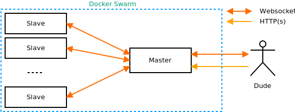
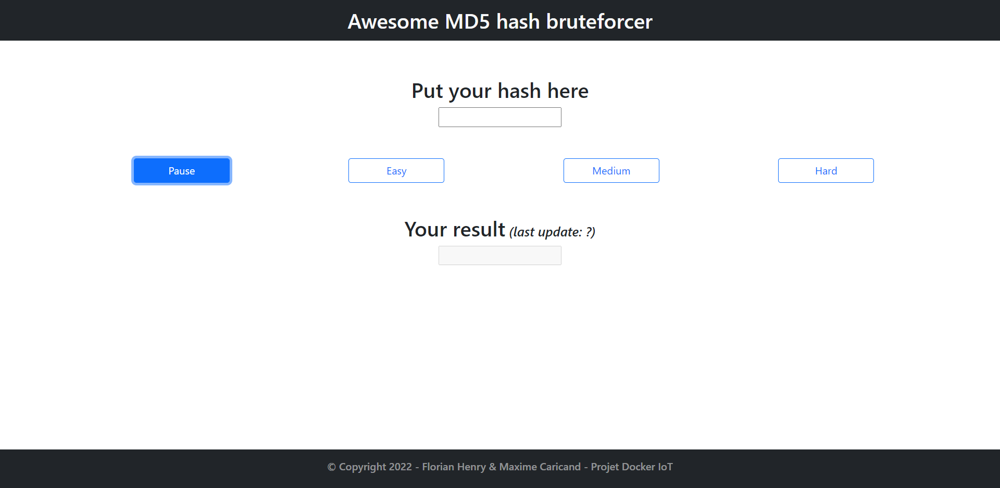

# DOCKER_MD5_BRUTFORCE

- Année   : M2 IWOCS
- Matière : IoT
- Projet  : Docker

## Auteur(s)

|Nom|Prénom|login|email|
|--|--|--|--|
| CARICAND | Maxime | mc171529 | caricand.maxime@etu.univ-lehavre.fr |
| HENRY | Florian | hf171907 | florian.henry@etu.univ-lehavre.fr |

<br>

## Travail à réaliser

<br>

### Consignes :

Votre infrastructure devra pouvoir répondre à des résolutions de hash MD5. Si la charge de travail (monitorer) devient trop importante, des containers devront être créer. Et inversement.

Il y aura donc des serveurs en écoute (scalabilité), un container capable de changer la scalabilité, et éventuellement une base de données capable de stocker les hash réussi (Redis ?).

<br>

<br>
<br>


Une petite appli capable d'envoyer des requètes (HTTP ou WebSocket) vers cette infra. Une petite interface utilisateur permettant de choisir des modes gentils, normals, agressifs est requise.

Le plus, serait d'avoir le monitoring plus ou moins (5 - 10 secondes) de l'infrastructure (idem par HTTP ou WebSocket par exemple).

Comment accède-t-on à Docker dans un container ? Avec <a href="https://hub.docker.com/_/docker" target="_blank" tabindex="0"> cette image</a> (docker:dind)

<br>

## Notre travail

<br>

### Dans un premier temps

Nous avons fait le serveur et le dude.<br>
Tout se lance en local avec un _docker-compose up_

 1. **Serveur :**

Il ouvre ses ports pour les websockets en 3100 et 3200.

Il permet la liaison entre le dude et les dockers. Il execute la commande pour lancer des dockers qui vont essayer de décoder le mot de passe envoyé via le dude puis qui vont le renvoyer au serveur.

<br>

 2. **Dude :**

Il ouvre son port en 3000 pour que l'on puisse se connecter sur l'interface en <a href='localhost:3000/'>localhost:3000/</a>

*Voila l'interface réalisée :*



Lorsque le bouton 'Pause' est sélectionné, aucun paquet n'est envoyé au serveur.

Lorsque l'un des autres boutons est sélectionné, des paquets sont envoyés en continues au serveur qui doit créer de nouveaux slaves pour décoder le message. La gestion des timings par mode de difficulté se fait grâce à des tâches CRON qui sont disponibles avec react-js.

<br>

### Dans un second temps

Une fois la première partie fonctionnelle en local, on a voulu faire un SWARM concret avec les commandes suivantes :

```docker swarm init```
```docker stack deploy --compose-file docker-compose.yml NomDeLaStack``` - changer NomDeLaStack

***Mais ce n'est actuellement pas totalement opérationne***

<br>

## Les éléments

### Présent

 1. Serveur fonctionnel
 2. Dude fonctionnel
 3. Communication entre serveur et dude fonctionnel

### Manquant

 1. Pas de GITLAB CI
 2. Le SWARM ne fonctionne pas totalement car pas d'accès au dude une fois lancé

<br>

## Pour lancer le projet

Deux possibilités mais qui ne fonctionnent pas tout a fait ensemble.

 1. Soit, pour accéder à l'interface et communiquer avec le serveur :

lancer ```docker-compose up```<br>
puis rendez-vous sur ```localhost:3000/```

Mais il y a une erreur au décodage du mot hasher, car le code va tenter d'augmenter le nombre de slave avec la commande :
```docker service scale -d slave NbSlave``` . Cela va provoquer une erreur car il n'y a pas de SWARM.

 2. Soit, pour lancer le SWARM, exécuter les commandes :

lancer ```docker swarm init```<br>
et  ```docker stack deploy --compose-file docker-compose.yml NomDeLaStack```